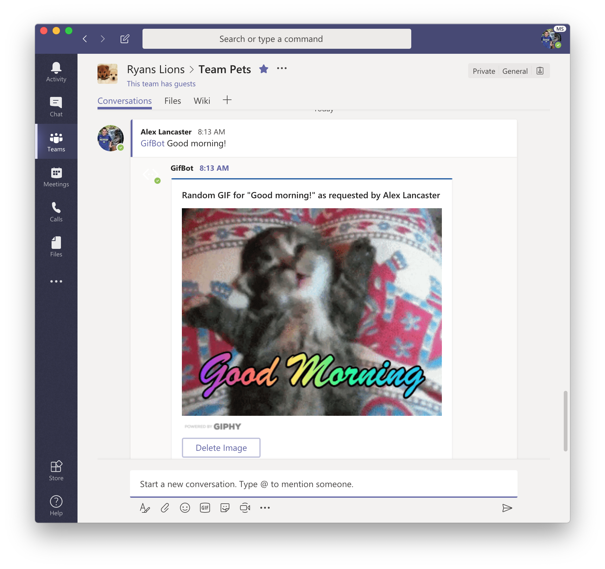

# GifBot

GifBot is your cute little bot friend who gives your team random GIFs. GifBot is developed in TypeScript, hosted on Azure, and uses Giphy as its back end. It can be connected to a variety of things, but its main use case is Microsoft Teams. This is also the app it is most thoroughly tested in (not a coincidence).

## How to use GifBot

First off, here is what a GifBot message will look like in Teams:


- To summon a GIF:

  - Message GifBot with whatever text you want to summon a GIF for.
  - Example in a Microsoft Team:

    ```bash
    @GifBot Hello
    ```

- To delete a previously summoned GIF:
  - Simply click the "Delete" button in the card

## How to contribute to GifBot

For instructions on how to contribute see [Contributing.md](Contributing.md)

## How to provide feedback about GifBot

The best way to provide feedback on GifBot is to file a bug or feature request to [GitHub Issues](https://github.com/alancast/RandomGifBot/issues)

## License

Licensed under the [MIT](LICENSE.txt) License.
